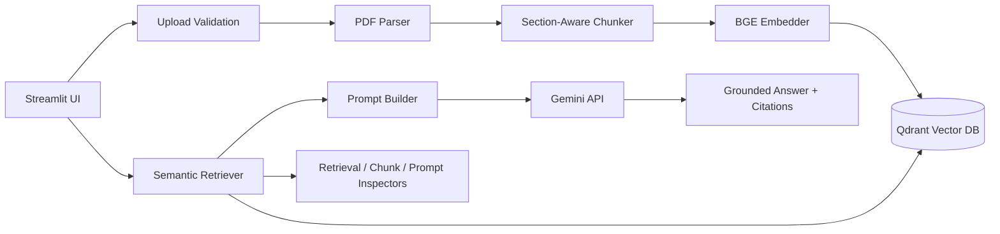

# LegalLens

LegalLens is an educational, production-style Retrieval-Augmented Generation project for legal contract intelligence. It demonstrates how a modern RAG system parses contracts, chunks them with metadata, embeds them, stores vectors in Qdrant, retrieves relevant evidence, builds a grounded prompt, calls Gemini, and returns cited answers.

It intentionally stays focused on RAG. There is no authentication, user database, billing, async worker system, or cloud platform layer.

## Architecture Diagram



## RAG Pipeline Diagram

```text
Upload Contract
  -> Validate and sanitize filename
  -> Detect duplicate content
  -> Parse PDF text, pages, headings, tables
  -> Clean text and skip empty pages
  -> Chunk with recursive splitter
  -> Assign nearest section heading
  -> Embed each chunk with BAAI/bge-small-en-v1.5
  -> Upsert vectors and metadata into Qdrant
  -> Embed user question
  -> Retrieve Top-K chunks once
  -> Display retrieval inspector
  -> Build prompt from retrieved chunks
  -> Display exact prompt
  -> Generate Gemini answer with retry and timeout
  -> Display citations and similarity scores
```

## Folder Explanation

```text
data/contracts/        Local uploaded contract PDFs
parser/                PDF parsing, page preservation, heading/table extraction
chunking/              Recursive chunking and nearest-heading section assignment
embeddings/            BAAI/bge-small-en-v1.5 embedding wrapper
vector_store/          Qdrant collection creation, validation, upsert, search
retrieval/             Query embedding and Top-K semantic search
prompts/               System prompt, context formatting, prompt parts
llm/                   Gemini client with timeout, retry, graceful failure
evaluation/            Retrieval trace and final prompt inspection
utils/                 Dataclasses, text utilities, upload validation, logging
config/                Runtime settings loaded from environment variables
tests/                 Lightweight unit tests for RAG components
app.py                 Streamlit educational interface
```

## Chunking Strategy

LegalLens uses `RecursiveCharacterTextSplitter` with token estimation instead of fixed character slicing. Defaults:

- Chunk size: 800 estimated tokens
- Chunk overlap: 100 estimated tokens
- Separators: paragraph, line, sentence, clause, word

Each chunk stores:

- Chunk ID
- File name
- Page number
- Nearest detected section heading
- Chunk index
- Token count
- Text

Empty pages are skipped during parsing, but original PDF page numbers are preserved for citations.

## Embedding Strategy

LegalLens uses `BAAI/bge-small-en-v1.5`, producing 384-dimensional normalized embeddings. Documents are embedded in batches during ingestion. User questions are embedded once per query. The app now reuses retrieved chunks for display, prompt construction, answer generation, and evaluation, avoiding duplicate embedding and Qdrant calls.

## Retrieval Strategy

Retrieval is semantic vector search:

1. Embed the user question.
2. Search Qdrant with cosine similarity.
3. Return Top-K chunks with payload metadata.
4. Display retrieved chunks before generation.
5. Build the prompt from exactly those chunks.

Qdrant stores payload indexes for `file_name` and `page_number`, making the metadata searchable and ready for future filtering.

## How Similarity Search Works

Both contract chunks and user questions are mapped into the same embedding space. Cosine similarity measures how close the question vector is to each chunk vector. Higher scores indicate stronger semantic similarity, but scores are not legal certainty. LegalLens displays them so users can judge retrieval quality.

## How Citations Work

Every retrieved chunk carries citation metadata. The UI displays:

- File name
- Page number
- Section
- Chunk ID
- Similarity score

The prompt also instructs Gemini to cite document name, page, section, and chunk ID in the generated answer.

## Retrieval Inspector

The Streamlit app shows retrieved chunks before answering. This helps debug whether the model is seeing relevant evidence.

## Chunk Inspector

After ingestion, the app exposes every chunk created in the current session, including chunk size, index, page number, section, ID, and text.

## Prompt Viewer

The app shows the exact prompt sent to Gemini, split into:

- System prompt
- Retrieved context
- User question
- Final prompt

This makes the grounding step transparent for learning and interviews.

## Configuration

Copy `.env.example` to `.env`:

```bash
cp .env.example .env
```

Set:

```text
GEMINI_API_KEY=your_google_gemini_key
QDRANT_URL=http://localhost:6333
```

Important settings:

- `CHUNK_SIZE`
- `CHUNK_OVERLAP`
- `TOP_K`
- `EMBEDDING_MODEL`
- `LLM_MODEL`
- `TEMPERATURE`
- `MAX_TOKENS`
- `LLM_TIMEOUT_SECONDS`
- `LLM_MAX_RETRIES`

## Run With Docker

```bash
docker compose up --build
```

Open:

```text
http://localhost:8501
```

## Run Locally

Start Qdrant:

```bash
docker run -p 6333:6333 -p 6334:6334 qdrant/qdrant:v1.9.7
```

Install dependencies:

```bash
python -m venv .venv
.venv\Scripts\activate
pip install -r requirements.txt
```

Run:

```bash
streamlit run app.py
```

## Tests

```bash
pytest
```

The tests are intentionally lightweight and cover upload validation, prompt building, chunking metadata, retrieval behavior, empty retrieval, and Gemini failure handling.

## Future Improvements

- OCR for scanned contracts.
- Hybrid BM25 plus vector retrieval.
- Cross-encoder reranking.
- Query rewriting for vague legal questions.
- Faithfulness scoring.
- Structured citation validation.
- Clause-type extraction.
- Golden-set retrieval evaluation.
- Local LLM option for private legal workflows.
